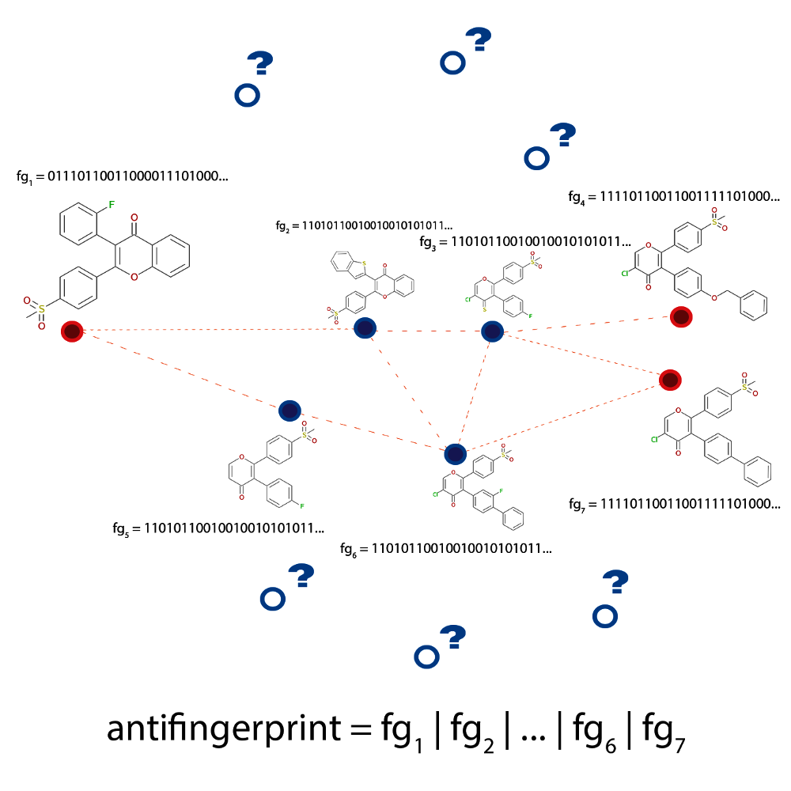

Exploration Algorithms Implementations
--------------------------------------

The library also provides complete implementations of a few
exploration algorithms (located in :mod:`molpher.algorithms`). This section briefly describes these algorithms
and shows how to use them. It is also recommended to look at
the source code documentation of the :mod:`~molpher.algorithms` package,
which contains some generally useful modules
(such as :mod:`~molpher.algorithms.functions` and :mod:`~molpher.algorithms.operations`).

Classic (Original) Algorithm
~~~~~~~~~~~~~~~~~~~~~~~~~~~~

This is the algorithm published with the :term:`Molpher`
program [1]_. It is the most basic algorithm
that can be implemented and a lot of fundamental concepts of
Molpher-lib are based on it. The other algorithms presented in this part of the documentation
are modifications or extensions of the original. It is, therefore,
recommended to read this section before moving on to the following ones.

The classic algorithm uses a single tree rooted at the `source molecule` (M\ :sub:`S`).
Using predefined `chemical operators`, it generates a new generation of structures from the leaves of this tree
at every iteration (see :numref:`morphing`).
The new list of candidates is then sorted (using the
:class:`~molpher.core.operations.SortMorphsOper.SortMorphsOper` operation)
in ascending order according to their structural distance
from the `target molecule` (M\ :sub:`T`).
Finally, the new structures are filtered with the
:class:`~molpher.core.operations.FilterMorphsOper.FilterMorphsOper`
operation and survivors are attached to their parents in the tree.
This is repeated until the target molecule is generated and appended to the tree.

As the computation proceeds, some tree branches are also pruned
(see :class:`~molpher.core.operations.PruneTreeOper.PruneTreeOper`). This is
necessary to prevent exponential growth of the tree by removing paths
that are not getting closer to the `target molecule`.

If you wish to know more about the steps involved
in this algorithm, a detailed description can be found in [1]_.

..      figure:: morphing.png
        :scale: 100%
        :name: morphing

        Schematic depiction of the original algorithm published by Hoksza et al. [1]_.
        New :term:`morphs <morph>` are generated with the `chemical operators` until the target
        molecule is found.

The classic algorithm is available through the `molpher.algorithms.classic` package
and can be used as follows:

..  literalinclude:: ../../../../src/python/molpher/examples/classic.py
        :language: python
        :caption: Usage example of the original algorithm.
        :name: classic-example
        :linenos:

The most essential ingredients in the example above are the :samp:`run()`
function and the appropriate :samp:`Settings` class.

Every algorithm in the library has a :samp:`run()` function
which calls the appropriate algorithm and saves
the output of the computation. The :samp:`run()` function
also supplies parameters to the tree and manages some 'global'
aspects when a path is generated (such as the maximum number of threads to use).

The behaviour of :samp:`run()` is configured using a :samp:`Settings`
class which is nothing more than a set of parameters wrapped into
a class object. Some algorithms might define their own :samp:`Settings`
classes with parameters specific to that algorithm. In this implementation, however,
the most general `Settings` class is used.

In this instance, :meth:`~molpher.algorithms.classic.run`
outputs a pickled `list` of SMILES strings
which represents the resulting path into `storage_dir`.

.. [1] Hoksza D., Škoda P., Voršilák M., Svozil D. (2014) Molpher: a software framework for systematic chemical space exploration. J Cheminform. 6:7.
        `PubMed <http://www.ncbi.nlm.nih.gov/pubmed/24655571>`_, `DOI <http://www.jcheminf.com/content/6/1/7>`_

..  _bidirectional:

Bidirectional Algorithm
~~~~~~~~~~~~~~~~~~~~~~~

The second algorithm included in the library is the bidirectional algorithm.
The goal is the same as in the classic approach -- to find
a path from the `source molecule` to the `target molecule`. However,
in this approach we use two trees (**A** and **B**) at once to get from M\ :sub:`S` to M\ :sub:`T`
(see :numref:`bidirectional-fig`). One is set up to search for a path from
M\ :sub:`S` to M\ :sub:`T` while the other searches in the opposite direction,
that is from M\ :sub:`T` to M\ :sub:`S`.

After every complete iteration of the original algorithm in both trees
(after the new structures are connected)
the `target molecule` in each tree is replaced by the closest
molecule to the current target from the opposite tree. This process is depicted
in :numref:`bidirectional-fig` where m\ :sub:`TA` is found to be
the closest molecule in tree **B** and, thus, becomes the new target of **A**.
Similarly, molecule m\ :sub:`TB` is the closest molecule to the current target
of **A** and, therefore, becomes the new target of **B**. This causes that
with each iteration the target of each tree becomes closer and closer.
The algorithm ends when any of the two trees finds its target
(the `connecting_molecule`).
This structure is guaranteed to exist in both trees and is used
to backtrack through them and generate the final path from M\ :sub:`S` to M\ :sub:`T`.

..      figure:: bidirectional.png
        :scale: 100%
        :name: bidirectional-fig

        Schematic depiction of the bidirectional algorithm. Two trees (**A** and **B**) are built
        at the same time with the `target <target molecule>`
        for each tree (m\ :sub:`TA` for **A** and m\ :sub:`TB` for **B**) being adjusted dynamically during runtime.

This algorithm should have some advantages over the classic one.
The biggest is probably the fact that the space
between M\ :sub:`S` and M\ :sub:`T` is explored in a more
uniform way. The classic algorithm can often converge
quickly to an area very close to M\ :sub:`T`, but
it usually takes a few more iterations before it finds the actual
structure of M\ :sub:`T`. This results in a disproportionate
number of molecules on the path being highly similar to M\ :sub:`T`.
This is not the case for the bidirectional search where
by the time the two trees get very close there
is already a lot of similar molecules between them
and it is much easier to find a connecting structure.

The bidirectional
approach might also be able to converge quicker,
because with each iteration the target gets closer and closer for each
tree and this significantly reduces the search space.

The following script shows how this algorithm can be used to generate
paths:

..  literalinclude:: ../../../../src/python/molpher/examples/bidirectional.py
        :language: python
        :caption: Usage example of the bidirectional pathfinding algorithm.
        :name: bidirectional-example
        :linenos:

The code above is almost identical to the example above (see :numref:`classic-example`).
It follows the same principles and the `Settings` class is also the same. The only difference
is that the run method is imported from `molpher.algorithms.bidirectional`
rather than `molpher.algorithms.classic`.

Anti-decoys Algorithm
~~~~~~~~~~~~~~~~~~~~~

The 'anti-decoys algorithm' is an extension of the bidirectional one
and it tries to solve a problem that the algorithms above have in common.
This problem is obvious when Molpher-lib is used to generate a focused library
of compounds by pooling together structures from multiple exploration runs.

Even though the algorithms above are not deterministic, there is
still a significant amount of overlap between the structures from
multiple runs. This is due to the fact that in the cases above the algorithm
is minimizing the distance between the `source molecule` and the `target molecule`
which is important to actually be able to find a path, but is a problem
when our aim is to generate a diverse library of structures because
shorter paths will be preferred and, thus,
contain highly similar compounds.

This unwanted behaviour is illustrated in :numref:`antidecoys-fig`
where the generated paths (dashed lines) between multiple compounds (shown in red)
are seen to traverse a very limited area of chemical space (compounds
marked with blue dots). However, it might still be possible to discover
interesting structures if the algorithm took a little 'detour'
and generated a path that is a bit longer, but contains some
previously 'unseen' structures (shown as blue circles with question marks).

In the anti-decoys approach, this problem is eliminated by generating an 'anti-fingerprint'.
It is a 2D phramacophore fingerprint
(`implemented in RDKit <http://www.rdkit.org/docs/GettingStartedInPython.html#d-pharmacophore-fingerprints>`_)
that contains information about all known and previously generated compounds. Because each
bit in a pharmacophore fingerprint encodes information about geometric relationship of certain pharmacophore
features in the structure, it is possible to cumulatively construct the anti-fingerprint by doing logical
:samp:`or` over the fingerprints of previously discovered structures (see :numref:`antidecoys-fig`). Therefore,
by minimizing the similarity to the anti-fingerprint and at the same time
minimizing the structural distance from the target, the unexplored areas
can be prioritized over those that were already sampled before.

        Schematic depiction of the problem the anti-decoys algorithm tries to solve. The
        paths generated between active molecules (dashed lines connecting the red circles)
        are limited to an area of chemical space occupied by highly similar
        structures, the decoys (shown in blue). The algorithm analyses the
        decoys and uses this information to avoid them in future explorations
        using an anti-fingerprint that is computed as a logical :samp:`or`
        over all known fingerprints.

The antidecoys algorithm can be used as follows:

..  literalinclude:: ../../../../src/python/molpher/examples/antidecoys.py
            :language: python
            :caption: Usage example of the antidecoys algorithm.
            :name: antidecoys-example
            :linenos:

This example is a little different from the ones before
and there is a little bit more customization involved.

The antidecoys algorithm uses a customized settings class called `AntidecoysSettings`.
In general, this class specifies important thresholds for the anti-fingerprint similarity
and how strict the algorithm will be when filtering morphs. See the
documentation of `AntidecoysSettings` to know more about this class and
the additional parameters.

The :samp:`run()` function is also a bit different here. Because it is
assumed that multiple paths will be generated, we also need to specify
how many of them to find.

Summary
~~~~~~~

In this section, the implementations of various chemical space exploration algorithms
were described. They are all based on the original algorithm implemented in :term:`Molpher`,
but the algorithms that can be implemented with the library do not have to be
built on this basis. There are many ways to implement chemical space exploration
using a library such as this one. For
example, we are currently working on an implementation that will be independent
of the `target molecule` and could be used to evolve compounds more freely
with constraints imposed only by the user. Soon, we will also implement
a way of preventing parts of the `source molecule` from being modified,
which could be very useful in lead optimization. We are also planning to give users
the option to define their own chemical operators, which will give an entirely new
meaning to the generated paths. There are many ways in which this library could
be useful in drug discovery, so if you have any
suggestions or would like to actively participate on the project, it
would be much appreciated. Make sure to visit the official
`GitHub <https://github.com/lich-uct/molpher-lib>`_ repository
for more information.