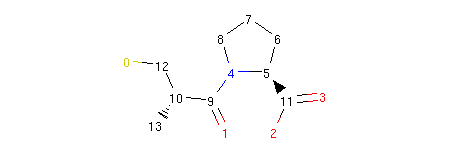
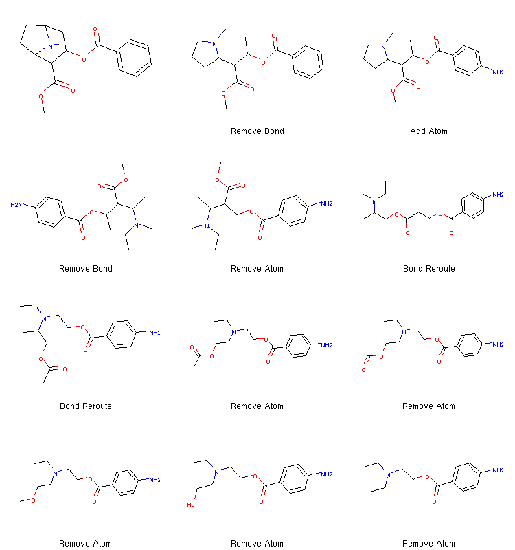

..  _exploration:

Implementing Chemical Space Exploration with Molecular Morphing
===============================================================

..  todo:: divide this doc into multiple smaller ones and use TOC to show contents

.. contents:: Table of Contents

In the :doc:`previous tutorial <morphing>`, we introduced some of the low level
Molpher-lib features that enable its user to modify molecular
structures in a randomized manner. In this part of the usage tutorial, we focus on
high level features that handle chemical space exploration on
larger scale by iterative application of :term:`chemical operators`.

The core data structure responsible for building and maintaining suggested
:term:`chemical space paths <chemical space path>` is the :term:`exploration tree`.
The exploration tree contains all generated morphs and is rooted at the :term:`source molecule`
and is grown by iteratively applying chemical operators
first on the source molecule, then on its descendants and so on. This way
multiple chemical space paths can be created and evaluated.

As the paths are generated, the compounds on them can be characterized by
the value of an objective function. This function should somehow formalize
the relationship between a chemical structure
and its fitness for the task at hand. Therefore,
interesting paths can be prioritized over others.
This way, the exploration tree can hopefully lead us towards interesting new compounds
without having to enumerate all possible chemistry.

In the original Molpher algorithm, the objective function is
simply the structural distance between morphs and a :term:`target molecule`.
This way Molpher is able to connect pairs of molecules by iteratively generating
morphs from the source and prioritizing those that are getting closer to the target.
As a result, the algorithm converges to the target structure and stops
once the target is identified among the generated morphs (:numref:`morphing-explore`). This
algorithm is called the *classic* algorithm and is
implemented in the `molpher.algorithms.classic` module.

..  seealso:: `alg-classic`

..      figure:: morphing.png
        :scale: 100%
        :name: morphing-explore

        Schematic depiction of the original algorithm published by Hoksza et al. [1]_.
        New :term:`morphs <morph>` are generated with `chemical operators`
        applied to the :term:`source molecule` (M\ :sub:`S`\ ) until the :term:`target
        molecule` (M\ :sub:`T`\) is found.

..  seealso:: Examples in this tutorial are included in a Jupyter Notebook
    which can be downloaded :download:`here <../../../notebooks/exploration.ipynb>`
    viewed `here <../../_static/exploration.html>`_. The example SDF can be found
    :download:`here <../../../notebooks/captopril.sdf>`.

.. [1] Hoksza D., Škoda P., Voršilák M., Svozil D. (2014) Molpher: a software framework for systematic chemical space exploration. J Cheminform. 6:7.
        `PubMed <http://www.ncbi.nlm.nih.gov/pubmed/24655571>`_, `DOI <http://www.jcheminf.com/content/6/1/7>`_

..  _tree-create:

Creating an Exploration Tree and Setting Morphing Parameters
------------------------------------------------------------

.. py:currentmodule:: molpher.core

In Molpher-lib, the tree is implemented as the `molpher.core.ExplorationTree` class.
Following the captopril example from the previous tutorial,
the simplest way to generate an exploration tree instance is
to call the :meth:`~.core.ExplorationTree.create` factory method:

..  code-block:: python
    :linenos:

    from molpher.core import ExplorationTree as ETree
    from molpher.core import MolpherMol

    captopril = MolpherMol("captopril.sdf")
    tree = ETree.create(source=captopril)

This code simply initializes the tree from the supplied :class:`MolpherMol` instance.
At the moment the tree is pretty simple. It only contains the captopril structure as its
current leaves:

..  code-block:: python

    tree.leaves[0].asRDMol()

Output:

We can manipulate this tree and read data from it. Let's start by printing out the
:term:`source molecule`:

..  code-block:: python

    print('Source: ', tree.params['source'])

Output:

..  code-block:: none

    Source:  CC(CS)C(=O)N1CCCC1C(=O)O

The `params` member is a dictionary used to set and store `morphing parameters`:

..  code-block:: python

    print(tree.params)

Output:

..  code-block:: python

    {
        'source': 'CC(CS)C(=O)N1CCCC1C(=O)O',
        'target': None,
        'operators': (
            'OP_ADD_ATOM',
            'OP_REMOVE_ATOM',
            'OP_ADD_BOND',
            'OP_REMOVE_BOND',
            'OP_MUTATE_ATOM',
            'OP_INTERLAY_ATOM',
            'OP_BOND_REROUTE',
            'OP_BOND_CONTRACTION'
        ),
        'fingerprint': 'FP_MORGAN',
        'similarity': 'SC_TANIMOTO',
        'weight_min': 0.0,
        'weight_max': 100000.0,
        'accept_min': 50,
        'accept_max': 100,
        'far_produce': 80,
        'close_produce': 150,
        'far_close_threshold': 0.15,
        'max_morphs_total': 1500,
        'non_producing_survive': 5
    }

As we can see there is quite a lot of parameters that we can set,
but most of these affect the exploration process only if
some parts of the library are used in the context of the tree, especially tree operations
which we will discuss :ref:`later <operations>`. The most important parameters
will be explained in this tutorial, but you can see the
documentation for the :py:class:`~ExplorationData.ExplorationData` class
(especially :numref:`param-table`) for a more detailed reference.

We can adjust the morphing parameters during runtime as we like.
All we need to overwrite the `params` attribute
of our tree instance with a new dictionary:

..  code-block:: python

    # change selected parameters using a dictionary
    tree.params = {
        'non_producing_survive' : 2
        , 'weight_max' : 500.0
    }
    print(tree.params)

Output:

..  code-block:: python

    {
        'source': 'CC(CS)C(=O)N1CCCC1C(=O)O',
        'target': None,
        'operators': (
            'OP_ADD_ATOM',
            'OP_REMOVE_ATOM',
            'OP_ADD_BOND',
            'OP_REMOVE_BOND',
            'OP_MUTATE_ATOM',
            'OP_INTERLAY_ATOM',
            'OP_BOND_REROUTE',
            'OP_BOND_CONTRACTION'
        ),
        'fingerprint': 'FP_MORGAN',
        'similarity': 'SC_TANIMOTO',
        'weight_min': 0.0,
        'weight_max': 500.0,
        'accept_min': 50,
        'accept_max': 100,
        'far_produce': 80,
        'close_produce': 150,
        'far_close_threshold': 0.15,
        'max_morphs_total': 1500,
        'non_producing_survive': 2
    }

Here we just tightened the constraints on molecular weight
for the morphs that we allow to be incorporated in the tree
(applied only if the :class:`~.operations.FilterMorphsOper.FilterMorphsOper` operation or `filterMorphs` method
are used with certain options) and we decreased the number of acceptable 'non-producing'
:term:`morph generations <morph generation>` to 2. Non-producing generations are
generations of morphs that has not improved in the objective function
(e.g. structural distance). See :numref:`param-table` for details.
One thing to note is that if we supply an incomplete set of parameters
(like in the example above), only the parameters specified in the
supplied dictionary will be changed. Parameters not mentioned in
this dictionary will remain the same as before the assignment.

..  warning:: Changing individual values in the `params` dictionary will have no effect.
    You always need to store a dictionary instance in it. This is because the value
    is regenerated every time the attribute is accessed to always reflect the current
    set of parameters valid for the current instance.

..  seealso:: :py:class:`~ExplorationData.ExplorationData`

Morph Generation and Exploration Tree Extension
-----------------------------------------------

This part of the tutorial outlines the steps
involved in one iteration of a possible exploration algorithm.
We explain how to generate new morphs from the leaves of the tree,
how they can be filtered and how the tree is
extended by attaching the chosen morphs as the
next generation of leaves. We also show how the unfavorable paths (or their parts)
can later be removed from the growing tree.

Morph Generation and Manipulation
~~~~~~~~~~~~~~~~~~~~~~~~~~~~~~~~~

`Previously <tree-create>`, we showed how to initialize an exploration tree.
Now that we have one, we can take a look at how to use it for :term:`chemical space`
exploration.

Let us generate a few :term:`morphs <morph>` from the current leaves of the tree.
Currently, the tree has just one leaf (our source molecule, captopril):

..  code-block:: python

    print(tree.leaves) # show the current leaves of the tree (only the source so far)
    tree.leaves[0].asRDMol()

Output:

..  code-block:: none

    (<molpher.core.MolpherMol.MolpherMol at 0x7f37a8a6d930>,)

..  figure:: captopril.png

Since we already have the built-in operators available by default,
we can generate new structures from this starting molecule like so:

..  code-block:: python
    :caption: Generating candidate morphs with an exploration tree.
    :name: gen-morphs-simple
    :linenos:

    tree.generateMorphs()
    print(len(tree.candidates))

Output:

..  code-block:: none

    28

The :meth:`~.core.ExplorationTree.ExplorationTree.generateMorphs()` method tells
the tree to generate some :term:`morphs <morph>`
from the current leaves for us. The number of generated morphs
will depend mostly on the `far_produce`, `close_produce` and `far_close_threshold`
parameters. However, it also depends on other factors. For example, some structures
might not be parsed correctly and, thus, might not make it to the final list.
Also, a different number of morphs can be generated each time the method is run. That si due to
the non-deterministic character of the morphing algorithm which chooses the morphing operators to
use and parts of the structure to modify randomly. Duplicate
molecules (based on the canonical smiles string) are also removed.

We can access the newly generated morphs from the `candidates`
member of the tree instance. It is a `tuple` of :py:class:`~MolpherMol.MolpherMol` instances.
These instances can be used to read and manipulate the generated morphs or
the compounds currently present in the tree.

..  attention:: The molecules saved in the `candidates` attribute of the tree actually do not
    belong to the tree just yet. See :ref:`extend` for more information on
    how tree ownership is assigned to molecules.

..  _sort-filter:

Sorting and Filtering
~~~~~~~~~~~~~~~~~~~~~

The order of the newly generated molecules in the `candidates` list has a meaning
for the search algorithm. The higher the position of a morph in this list,
the bigger the probability that we will attach it to the tree as a new leaf
(see `PROBABILITY` for details). Therefore, by sorting this list according
to a given objective function, it is possible to push the algorithm
into convergence.

As of yet, the only way to sort the
generated morphs is by calling the :py:meth:`~molpher.swig_wrappers.core.ExplorationTree.sortMorphs`
method on the tree instance or using the :py:class:`~operations.SortMorphsOper.SortMorphsOper` operation
(see :ref:`operations` for more). This sorts the molecules in the order of increasing value
of the objective function. Right now, the objective function value used
by the `sortMorphs` operation is the value of the `dist_to_target` property
of the given :class:`~.core.MolpherMol` instance. By default, the value
of this property indicates the structural distance of the morph in question
from the target molecule.

Since in our case we did not specify a target, the `dist_to_target` property will
be set to the same value for all molecules:

..  code-block:: python

    {x.dist_to_target for x in tree.candidates}

Output:

..  code-block:: none

    {1.7976931348623157e+308}

However, the `dist_to_target` property value can be changed to basically any float number.
If users have a custom objective function they want to use in the search,
it is possible to write their calculated value to this property and as long as lower value means
better fitness of the morph, it should still make sense to use this function
in the context of Molpher-lib and its data structures.

..  note:: This part of the interface (especially the naming convention) will
    likely change in the future since a more general approach is needed in order to make sorting more
    customizable.

:ref:`Previously <morphing-bulk>`, we introduced the concept of morph collectors,
which are special functions that can be used to intercept morphs as they are created.
Setting the objective function value for each morph is a perfect use case for them:

..  code-block:: python
    :caption: Using the :meth:`~.core.ExplorationTree.generateMorphs` method with a custom morph collector.
    :name: collector-example
    :linenos:

    def sascore_as_obj(morph, operator):
        morph.dist_to_target = morph.sascore

    tree.generateMorphs([sascore_as_obj])
    print(len(tree.candidates))
    {x.dist_to_target for x in tree.candidates}

Output (some results omitted):

..  code-block:: none

    28

    [4.304767951403637,
     4.161464339486345,
     3.8871106534610247,
     ...
     4.336516757110866,
     4.187278867161213,
     3.8893996483733346]

This code is essentially the same as in :numref:`gen-morphs-simple`,
but this time we chose to add a custom morph collector
(the :code:`sascore_as_obj` function),
which will set a molecule's :term:`SAScore` as the objective
function value for all generated morphs. Notice
that the :meth:`~.core.ExplorationTree.generateMorphs` method takes a list of collectors
so it is possible to chain them together.
They are applied in the order of appearance in the list.

As you can see, the list of candidates is not sorted, yet.
We need to call the :meth:`~.core.ExplorationTree.sortMorphs` method to do that:

..  code-block:: python
    :caption: Sorting morphs according to the value of the objective function.
    :linenos:

    tree.sortMorphs()

    [
        (x.smiles, x.dist_to_target)
        for idx,x in enumerate(tree.candidates)
    ]

Output (some results omitted):

..  code-block:: none

    [('CC(C)C(=O)N1CCCC1C(=O)O', 3.3191105796423788),
     ('CC(CO)C(=O)N1CCCC1C(=O)O', 3.6043596148886445),
     ('CNC(CS)C(=O)N1CCCC1C(=O)O', 3.7075484704945465),
    ...
     ('O=C(O)C1CCCN1C(=O)C(CS)CBr', 4.404706288979395),
     ('CC(CSI)C(=O)N1CCCC1C(=O)O', 4.412717102918789),
     ('O=C(O)C1CCCN1C(=O)C(CF)CS', 4.420781866555153)]

Therefore, now the list of candidates is sorted according
to their synthetic accessibility (compounds
that are easier to prepare *in vitro* should have lower scores).

Now, we need to choose the morphs that
will form the next :term:`generation <morph generation>`.
The `candidates_mask` property of :class:`~.core.ExplorationTree`
serves exactly this purpose. Each position in this list corresponds to
one molecule in `candidates` and indicates
whether this molecule should be considered when
attaching new leaves to the tree (`True`) or not (`False`).
Here is an example implementation of a very simple filtering procedure:

..  code-block:: python
    :caption: A simple morph filter that selects only the first ten closest morphs from the list.
    :name: filtering-morphs
    :linenos:

    # print the current candidates mask (all positions are on by default)
    print("Old mask:", tree.candidates_mask)

    # accept only the first ten morphs in the sorted list (those with the lowest distance to target)
    new_mask = [True if idx < 10 else False for idx, x in enumerate(tree.candidates_mask)]

    # save the new mask to the tree
    tree.candidates_mask = new_mask

    # show results
    print("New mask:", tree.candidates_mask)
    print("Molecules that passed the filter:")
    [
        (x.smiles, x.dist_to_target)
        for idx,x in enumerate(tree.candidates)
        if tree.candidates_mask[idx] # get molecules that passed the filter only
    ]

Output:

..  code-block:: none

    Old mask: (True, True, True, True, True, True, True, True, True, True, True, True, True, True, True, True, True, True, True, True, True, True)
    New mask: (True, True, True, True, True, True, True, True, True, True, False, False, False, False, False, False, False, False, False, False, False, False)
    Molecules that passed the filter:

    [('CC(C)C(=O)N1CCCC1C(=O)O', 3.3191105796423788),
     ('CCC(C)C(=O)N1CCCC1C(=O)O', 3.404002369297247),
     ('CSCCC(=O)N1CCCC1C(=O)O', 3.613205289055311),
     ('CC(CS)C(=O)N1CCCC1C(=O)O', 3.804751376555311),
     ('O=C(O)C1CCCN1C(=O)CCS', 3.8871106534610247),
     ('O=C(O)C1CCCN1C(=O)CCCS', 3.9220880467166013),
     ('CC(S)CC(=O)N1CCCC1C(=O)O', 3.9366697951036973),
     ('O=C(O)C1CCCN1C(=O)C1CSC1', 3.9784865729838823),
     ('CC(S)C(=O)N1CCCC1C(=O)O', 3.9938638051851627),
     ('CC(NCS)C(=O)N1CCCC1C(=O)O', 4.076862613435724)]

In :numref:`filtering-morphs`, `candidates_mask` member was changed by writing
a `list` or a `tuple` of new values into it. This way we were able to select only the first ten morphs
that have the best `SAScore` value.

..  warning:: The mask should only be set after the morphs are sorted. If the mask is set and
    the order of morphs is changed, the mask will stay the same and will have to be updated
    to follow the new order.

..  seealso:: The library implements a few built-in filters. You can use the
    `filterMorphs()` method or :class:`~.operations.FilterMorphsOper` operation to invoke them.
    See the method's documentation for more information
    on the available filtering options.

.. _extend:

Tree Extension
~~~~~~~~~~~~~~

When we have the morphs selected, we can call
the `extend()` method. This will connect them to their respective parents
in our tree and they will become a new set of leaves:

..  code-block:: python
    :caption: Extending the exploration tree with new morphs.
    :name: extending-tree
    :linenos:

    # get the number of generations before
    print(tree.generation_count)

    tree.extend() # connect the accepted morphs to the tree as new leaves

    # get the number of generations after
    print(tree.generation_count)

    # grab the new leaves as a list sorted according to their distance from target
    sorted(
        [
            (x.getSMILES(), x.getDistToTarget())
            for x in tree.leaves
        ], key=lambda item : item[1]
    )

Output:

..  code-block:: none

    WARNING: Candidate morph: CC(CS)C(=O)N1CCCC1C(=O)O already present in the tree. Skipping...
    0
    1

    [('CC(C)C(=O)N1CCCC1C(=O)O', 3.3191105796423788),
     ('CCC(C)C(=O)N1CCCC1C(=O)O', 3.404002369297247),
     ('CSCCC(=O)N1CCCC1C(=O)O', 3.613205289055311),
     ('CSC(C)C(=O)N1CCCC1C(=O)O', 3.8501001628456333),
     ('O=C(O)C1CCCN1C(=O)CCS', 3.8871106534610247),
     ('CCC(CS)C(=O)N1CCCC1C(=O)O', 3.8893996483733346),
     ('CSCC(C)C(=O)N1CCCC1C(=O)O', 3.916140148729842),
     ('O=C(O)C1CCCN1C(=O)CCCS', 3.9220880467166013),
     ('CC(S)CC(=O)N1CCCC1C(=O)O', 3.9366697951036973)]

We can see that after extending the tree, the selected morphs (see :numref:`filtering-morphs`)
had become the new leaves and that the tree's
:term:`morph generation` counter (`generation_count`) was increased by one. We also
got a warning about one structure not being added to the tree. It is the structure
of captopril itself, which is already there. Thus, it is automatically skipped to prevent us from going
in circles.

If we want to, we can generate an image depicting the new leaves and the operators used to create them like so:

..  code-block:: python

    from rdkit.Chem.Draw import MolsToGridImage

    def get_locked_atoms(mol):
        return [(idx, atm) for idx, atm in enumerate(mol.atoms) if atm.is_locked]

    def show_mol_grid(mols):
        locked_atoms = [[y[0] for y in get_locked_atoms(x)] for x in mols]
        return MolsToGridImage(
            [x.asRDMol() for x in mols]
            , subImgSize=(250,200)
            , highlightAtomLists=locked_atoms
            , legends=[x.parent_operator for x in mols]
        )

    show_mol_grid(tree.leaves)

Output:

..  figure:: leaves.png

Note that the generated morphs satisfy the locks placed on the signature -pril substructure
in the original SDF file. Therefore, the tree is guaranteed to only contain structures
that have this structural pattern. At this point, it is probably easy to envision an approach with
iterative application of the commands above which would allow us to generate
many possible structures of novel -pril compounds. This could prove useful
while exploring the structure-activity relationship in the development
of new ACE inhibitors, for example. Here is an example how a simple exploration
algorithm for this purpose could look like:

..  code-block:: python

    class PenalizeKnown:

        def __init__(self, tree, penalty):
            self._tree = tree
            self._penalty = penalty

        def __call__(self, morph, operator):
            if self._tree.hasMol(morph):
                morph.dist_to_target += self._penalty

    for iter_idx in range(1,10):
        tree.generateMorphs([sascore_as_obj, PenalizeKnown(tree, 10)])
        tree.sortMorphs()

        tree.candidates_mask = [
            True if idx < 50 and tree.candidates[idx].sascore < 6
            else False
            for idx, x in enumerate(tree.candidates_mask)
        ]

        tree.extend()

As in previous example (:numref:`collector-example`), this code uses SAScore as the objective function,
but this time we added one more collector to penalize morphs that we already attached to the tree.
This way we can use a similar filtering procedure as before and run the code iteratively.
In every iteration, we accept at most 50 structures which have synthetic accessibility
score lower than 6. Running ten iterations
like this gives us almost 500 new structures in a few seconds. If we chose to ran the algorithm
for a few hours, we would get thousands of compounds like this for subsequent screening. At this
point, it is probably obvious that we could add more collectors that could adjust the fitness
of each morph further. For example, we could penalize morphs that have too many atoms, stereocenters
or other unwanted structural features.

As the final example in this section, we add a target molecule to the tree
and show how to use Molpher-lib for the task Molpher was originally designed for,
that is to search for chemical space paths. We will choose another ACE inhibitor as
our target, enalapril:

..  code-block:: python

    # set enalapril as target
    tree.params = {
        'target' : MolpherMol("O=C(O)[CH]2N(C(=O)[CH](N[CH](C(=O)OCC)CCc1ccccc1)C)CCC2")
    }
    tree.params

Output:

..  code-block:: none

    {'source': 'CC(CS)C(=O)N1CCCC1C(=O)O',
     'target': 'CCOC(=O)C(CCC1=CC=CC=C1)NC(C)C(=O)N1CCCC1C(=O)O',
     'operators': ('OP_ADD_ATOM',
      'OP_REMOVE_ATOM',
      'OP_ADD_BOND',
      'OP_REMOVE_BOND',
      'OP_MUTATE_ATOM',
      'OP_INTERLAY_ATOM',
      'OP_BOND_REROUTE',
      'OP_BOND_CONTRACTION'),
     'fingerprint': 'FP_MORGAN',
     'similarity': 'SC_TANIMOTO',
     'weight_min': 0.0,
     'weight_max': 500.0,
     'accept_min': 50,
     'accept_max': 100,
     'far_produce': 80,
     'close_produce': 150,
     'far_close_threshold': 0.15,
     'max_morphs_total': 1500,
     'non_producing_survive': 2}

Now that we have a target, we can leverage the features
Molpher-lib inherited from Molpher to find a chemical
space path between captopril and enalapril:

..  code-block:: python

    class FindClosest:

        def __init__(self):
            self.closest_mol = None
            self.closest_distance = None

        def __call__(self, morph):
            if not self.closest_mol or self.closest_distance > morph.dist_to_target:
                self.closest_mol = morph
                self.closest_distance = morph.dist_to_target

    closest_info = FindClosest()
    while not tree.path_found:
        tree.generateMorphs()
        tree.sortMorphs()
        tree.filterMorphs()
        tree.extend()
        tree.prune()
        tree.traverse(closest_info)
        print('Generation #', tree.generation_count, sep='')
        print('Molecules in tree:', tree.mol_count)
        print(
            'Closest molecule to target: {0} (Tanimoto distance: {1})'.format(
                closest_info.closest_mol.getSMILES()
                , closest_info.closest_distance
            )
        )

Output (some contents omitted):

..  code-block:: none

    Generation #11
    Molecules in tree: 405
    Closest molecule to target: CCCC(C)NC(C)C(=O)N1CCCC1C(=O)O (Tanimoto distance: 0.47457627118644063)
    Generation #12
    Molecules in tree: 481
    Closest molecule to target: CCOC(C)NC(C)C(=O)N1CCCC1C(=O)O (Tanimoto distance: 0.4576271186440678)
    Generation #13
    Molecules in tree: 555
    Closest molecule to target: CCOC(=O)C(C)NC(C)C(=O)N1CCCC1C(=O)O (Tanimoto distance: 0.375)
    ...
    Generation #42
    Molecules in tree: 365
    Closest molecule to target: CCOC(=O)C(CCC1=CC=C1)NC(C)C(=O)N1CCCC1C(=O)O (Tanimoto distance: 0.09259259259259256)
    Generation #43
    Molecules in tree: 395
    Closest molecule to target: CCOC(=O)C(CCC1=CC=C1)NC(C)C(=O)N1CCCC1C(=O)O (Tanimoto distance: 0.09259259259259256)
    Generation #44
    Molecules in tree: 424
    Closest molecule to target: CCOC(=O)C(CCC1=CC=CC=C1)NC(C)C(=O)N1CCCC1C(=O)O (Tanimoto distance: 0.0)

Since we have a target structure defined, the software now
automatically calculates the distance of each morph from the target
and inserts that into the `dist_to_target` property
at the time of generation (call to :meth:`~.core.ExplorationTree.generateMorphs`).
Therefore, we don't need any customized collector in this instance. We also
chose to use the built-in filters (the :meth:`~.core.ExplorationTree.filterMorphs` method)
to prioritize morphs in the `candidates` property. This filtering also
includes a synthetic accessibility filter like the one we used above
(only structures with :term:`SAScore` higher than 6 are considered).

There are also a few features in this code that we haven't studied in detail, yet.
For example, we used the :meth:`~.core.ExplorationTree.traverse` method here to find out the closest
molecule to the target after finishing each iteration. Thanks to
this we can watch the algorithm converge to the target structure. We also used the
:meth:`~.core.ExplorationTree.prune` method which is used to remove
branches in the tree that are not converging towards the target. This helps
to curb exponential growth of the tree. How this method works is
discussed in more detail :ref:`later <prune>`.

If we want to get a hold of the molecules on the path, we can easily do so:

..  code-block:: python

    path = tree.fetchPathTo(tree.params['target'])

    print(len(path))
    show_mol_grid(path)

Output:

..  code-block:: none

    42

..  figure:: captopril_2_enalapril.png

..  note:: We can see that what appeared to be especially challenging for
    the algorithm was the creation of the aromatic ring at the
    end. This is an issue often observed with the original
    algorithm implemented in Molpher. It usually doesn't take
    a long time to converge to a structure which is very similar
    to the target, but more effort is needed to actually generate the target structure
    itself. Fortunately, Molpher-lib
    has at least some answer to that (see :ref:`bidirectional`).

.. _prune:

Tree Pruning
~~~~~~~~~~~~

We cannot possibly grow the tree into all directions without soon running out
of memory or wasting computational time on a non-prospective part of chemical space.
Thus, a strategy to keep the number of explored putative paths to a minimum is needed.
This can be achieved by discarding parts of the paths that
are not improving in the value of the objective function
(distance from the :term:`target molecule` in the simplest case).

We call a molecule that has not generated any morphs closer to the target than itself
a :term:`non-producing molecule` and we can set
the number of generations to wait before removing its descendants
with the `non_producing_survive` parameter.

Tree pruning can be requested anytime by calling the `prune()` method. In our example, the method didn't prune
any paths, because the `non_producing_survive` parameter is set to 2 generations in this particular instance.

..  seealso:: In addition to the `non_producing_survive` parameter, there is the `max_morphs_total` parameter,
    which imposes a restriction on the maximum number of
    descendants of one :term:`non-producing molecule`. If the number of all historic descendants
    reaches this threshold, the molecule is removed along with the current descendants.

Now we know the basics about the main building blocks that Molpher-lib offers and we showed
how to implement a basic chemical space exploration algorithm. In the following sections,
we describe more advanced topics and introduce other helpful features of the library.

..  _operations:

Tree Operations
---------------

In the previous section, we introduced a few methods of the :class:`~.core.ExplorationTree`
that we can use to generate new morphs and extend the exploration tree (such
as :meth:`~.core.ExplorationTree.generateMorphs` or :meth:`~.core.ExplorationTree.extend`).
These methods, however, have one thing in common. They work with a single
exploration tree instance and change it somehow. Therefore, their functionality
can be defined with an interface and that is what we will cover in this section,
the *tree operation* interface and how to use it.

We call every action that is performed on an :term:`exploration tree` a *tree operation*.
This concept is represented in the library with the :class:`~molpher.core.operations.TreeOperation`
abstract class and it becomes useful when we need to control
several exploration trees at once or if we just prefer to separate the tree itself from the
logic of our exploration algorithm.

..  note:: Tree operations were mainly created to house different parts of the exploration algorithm
    and to make them more encapsulated and configuration more intuitive. However, this transition is still
    far from complete so most of the built-in operations take their parameters from the `params` property,
    which is defined globally for the tree in question. Most of these parameters will eventually be
    encapsulated by their respective operations, though.

When we have defined our own operation, we can run it on a tree by supplying it to the
`runOperation()` method. Here is an example of how to define a customized filtering
procedure (similar to the one used :ref:`before <filtering-morphs>`) and incorporate it
in an exploration algorithm:

..  code-block:: python
    :caption: Using tree operations to define an iteration of a simple chemical space exploration algorithm.
    :name: operations-example
    :linenos:

    import molpher
    from molpher.core.operations import *
    from molpher.core import MolpherMol, ExplorationTree as ETree

    class MyFilterMorphs(TreeOperation):
        """
        A custom tree operation that accepts
        only the first ten morphs after
        the list of candidates is sorted.
        """

        def __call__(self):
            """
            This method is called automatically by the tree.
            The tree this operation is being run on is accessible
            from the 'tree' member of the class.
            """

            self.tree.candidates_mask = [
                True if idx < 20 and self.tree.candidates[idx].sascore < 6
                else False
                for idx, x in enumerate(self.tree.candidates_mask)
            ]

    cocaine = MolpherMol('CN1[CH]2CC[CH]1[CH](C(OC)=O)[CH](OC(C3=CC=CC=C3)=O)C2')
    procaine = MolpherMol('O=C(OCCN(CC)CC)c1ccc(N)cc1')
    tree = ETree.create(source=cocaine, target=procaine) # create the tree

    # list of tree operations, defines one iteration
    iteration = [
        GenerateMorphsOper()
        , SortMorphsOper()
        , MyFilterMorphs() # our custom filtering procedure
        , ExtendTreeOper()
        , PruneTreeOper()
    ]

    # apply the operations in the list one by one
    for oper in iteration:
        tree.runOperation(oper)

    # observe the results
    print(tree.generation_count)
    print(len(tree.leaves))

Output:

..  code-block:: none

    1
    18

..  seealso:: This and other advanced examples are included in a Jupyter Notebook
    which can be downloaded :download:`from here <../../../notebooks/exploration_advanced.ipynb>`
    or `viewed directly <../../_static/exploration_advanced.html>`_.

Except for the source and target molecule, this algorithm is similar to what
we have seen before, but this time we used operations instead of calling
the corresponding methods on the tree. We used a customized operation for the filtering step
by creating a subclass of the :class:`~molpher.core.operations.TreeOperation`
abstract class and we overrode its
:py:meth:`~molpher.swig_wrappers.core.TreeOperation.__call__` method with the implementation we want.

Each operation can have a tree associated with it, but it is not necessary
(we had no problems initializing the operations without a tree in the previous example).
We can verify if a tree is associated with an operation by calling
its :meth:`~operations.TreeOperation.TreeOperation.getTree()`
method or accessing the `TreeOperation.tree` attribute of the class.
If there is no tree associated with the instance, they both return `None`.
We can set the tree to operate on by writing into the `TreeOperation.tree`
attribute or calling the `TreeOperation.setTree` method. Then the operation
becomes callable (calling it will result in a `RuntimeError`).

Built-in Operations
~~~~~~~~~~~~~~~~~~~

..  warning:: This section is not yet complete because
    most of these operations will change their interface in the feature.
    We only describe the :class:`~.operations.TraverseOper.TraverseOper`
    class, which has more practical use than the others and its
    interface will not undergo much change in the future. For the other operations,
    we kindly refer the reader to their respective documentation pages.

In this section, we describe the few operations the library inherited from Molpher:

    - :py:class:`~operations.GenerateMorphsOper.GenerateMorphsOper`
    - :py:class:`~operations.SortMorphsOper.SortMorphsOper`
    - :py:class:`~operations.FilterMorphsOper.FilterMorphsOper`
    - :py:class:`~operations.FindLeavesOper.FindLeavesOper`
    - :py:class:`~operations.ExtendTreeOper.ExtendTreeOper`
    - :py:class:`~operations.PruneTreeOper.PruneTreeOper`
    - :py:class:`~operations.TraverseOper.TraverseOper`
    - :py:class:`~operations.CleanMorphsOper.CleanMorphsOper`

They are all derived from :class:`~molpher.swig_wrappers.core.TreeOperation` and contain
the full set of operations performed on a tree in
the original Molpher algorithm as published in [1]_. Therefore, the original algorithm can be
implemented using those operations.

..  _tree-traversal:

Traversing the Tree
^^^^^^^^^^^^^^^^^^^

A special place among these operations belongs to the :py:class:`~operations.TraverseOper.TraverseOper`
class. It does not directly implement a part
of a morphing algorithm, but serves as a means of traversing molecules in a tree and reading/modifying them
as needed:

..  code-block:: python
    :caption: Traversing the tree using a callback.
    :name: traverse-example
    :linenos:

    from molpher.core.operations.callbacks import TraverseCallback

    class MyCallback(TraverseCallback):
        """
        This callback just prints some information
        about the molecules in the tree.

        """

        def __call__(self, morph):
            """
            Method called on each morph in the tree
            -- starting from the root to leaves.

            """

            if not morph.getParentSMILES():
                print("# Root #")
            else:
                print('# Morph #')
                print('Parent:', morph.getParentSMILES())
            print('SMILES: ', morph.getSMILES())
            print('Descendents: ', morph.getDescendants())

    callback = MyCallback() # initialize a callback
    traverse = TraverseOper(callback=callback) # attach it to a tree traversal operation
    tree.runOperation(traverse) # run the operation

Output:

..  code-block:: none

    # Root #
    SMILES:  COC(=O)C1C2CCC(CC1OC(=O)C1=CC=CC=C1)N2C
    Descendents:  ('COC(=O)C1C(COC(=O)C2=CC=CC=C2)C2CCC1N2C', 'COC(=O)C1C2CCC(CC1OC(=O)C1=CC=C(N)C=C1)N2C', 'COC(=O)CC1CCC(CCOC(=O)C2=CC=CC=C2)N1C')
    # Morph #
    Parent: COC(=O)C1C2CCC(CC1OC(=O)C1=CC=CC=C1)N2C
    # Morph #
    Parent: COC(=O)C1C2CCC(CC1OC(=O)C1=CC=CC=C1)N2C
    SMILES:  COC(=O)C1C(COC(=O)C2=CC=CC=C2)C2CCC1N2C
    Descendents:  ()
    # Morph #
    Parent: COC(=O)C1C2CCC(CC1OC(=O)C1=CC=CC=C1)N2C
    SMILES:  COC(=O)C1C2CCC(CC1OC(=O)C1=CC=C(N)C=C1)N2C
    SMILES:  COC(=O)CC1CCC(CCOC(=O)C2=CC=CC=C2)N1C
    Descendents:  ()
    Descendents:  ()

..  note:: The tree traversal algorithm uses multiple threads. Therefore,
    the output might appear a little messy.

In :numref:`traverse-example` we derive from the `TraverseCallback` class, an abstract class with
an abstract method :meth:`~molpher.swig_wrappers.core.TraverseCallback.__call__`. This method takes one argument,
which is a :class:`~molpher.core.MolpherMol.MolpherMol` instance
of a molecule in the tree. We need to override this method in our derived class in order to implement our own
behaviour.

The callback is then associated with a :py:class:`~operations.TraverseOper.TraverseOper`
instance, which can be run on a tree as any other
tree operation. When the operation is run it traverses the tree from the root to the leaves and injects
every molecule it encounters into our implementation of the
:meth:`~molpher.swig_wrappers.core.TraverseCallback.__call__` method.

..  note:: We can also pass a SMILES string to the :py:class:`~operations.TraverseOper.TraverseOper`
    constructor. In that case, a subtree will be traversed
    using the specified molecule as the root of the subtree.

There is also a much more convenient way to traverse the tree. Because, the `ExplorationTree` class implements
the :meth:`molpher.core.ExplorationTree.ExplorationTree.traverse()` method, we can simply take any python callable and use it instead of the
:meth:`~molpher.swig_wrappers.core.TraverseCallback.__call__` method.
However, under the hood it does the same thing as we did in :numref:`traverse-example`.
Therefore, the above code can be turned into:

..  code-block:: python
    :caption: Traversing the tree using a callback -- the simple version.
    :name: short-traverse-example
    :linenos:

    def process(morph):
        """
        Prints some information
        about the molecules in the tree.

        """

        if not morph.getParentSMILES():
            print("# Root #")
        else:
            print('# Morph #')
            print('Parent:', morph.getParentSMILES())
        print('SMILES: ', morph.getSMILES())
        print('Descendents: ', morph.getDescendants())

    tree.traverse(process) # use the traverse method to run the callback function

Output:

..  code-block:: none

    # Root #
    SMILES:  COC(=O)C1C2CCC(CC1OC(=O)C1=CC=CC=C1)N2C
    Descendents:  ('COC(=O)C1C(COC(=O)C2=CC=CC=C2)C2CCC1N2C', 'COC(=O)C1C2CCC(CC1OC(=O)C1=CC=C(N)C=C1)N2C', 'COC(=O)CC1CCC(CCOC(=O)C2=CC=CC=C2)N1C')
    # Morph #
    Parent: COC(=O)C1C2CCC(CC1OC(=O)C1=CC=CC=C1)N2C
    SMILES:  COC(=O)CC1CCC(CCOC(=O)C2=CC=CC=C2)N1C
    Descendents:  ()
    # Morph #
    Parent: COC(=O)C1C2CCC(CC1OC(=O)C1=CC=CC=C1)N2C
    SMILES:  COC(=O)C1C2CCC(CC1OC(=O)C1=CC=C(N)C=C1)N2C
    Descendents:  ()
    # Morph #
    Parent: COC(=O)C1C2CCC(CC1OC(=O)C1=CC=CC=C1)N2C
    SMILES:  COC(=O)C1C(COC(=O)C2=CC=CC=C2)C2CCC1N2C
    Descendents:  ()

..  _templates-snapshots:

Tree Templates and Snapshots
----------------------------

We don't always have to initialize :term:`morphing parameters` by hand. We can use an :term:`XML template` instead.
Here is an example of a template file (you can download this one
from :download:`here <../../../../src/python/molpher/examples/cocaine-procaine-template.xml>`):

..  literalinclude:: ../../../../src/python/molpher/examples/cocaine-procaine-template.xml
        :language: xml
        :caption: A complete XML template file.
        :name: template-file
        :linenos:

An :term:`XML template` is similar to a configuration file and can be loaded
just like a snapshot (see :numref:`loading-snapshot`), but the resulting tree
will only contain the :term:`source molecule` as its root.

..  code-block:: python
    :caption: Loading a template and saving a built tree as a XML snapshot.
    :name: saving-snapshot
    :linenos:

    template_file = 'cocaine-procaine-template.xml'

    tree = ETree.create(template_file)
    print(tree.params)

    # apply the tree operations
    for oper in iteration:
        tree.runOperation(oper)

    print(
        sorted( # grab the new leaves as a list sorted according to their distance from target
        [
            (x.getSMILES(), x.getDistToTarget())
            for x in tree.leaves
        ], key=lambda x : x[1]
        )
    )

    # save the tree in a snapshot file
    tree.save('snapshot.xml')

Output:

..  code-block:: none

    The new iteration has been created from template:
    source: CN1[C@H]2CC[C@@H]1[C@@H](C(=O)OC)[C@@H](OC(=O)c1ccccc1)C2
    target: O=C(OCCN(CC)CC)c1ccc(N)cc1

    {
        'max_morphs_total': 1500,
        'far_close_threshold': 0.15,
        'weight_max': 500.0,
        'close_produce': 150,
        'fingerprint': 'MORGAN',
        'accept_min': 50,
        'source': 'COC(=O)C1C2CCC(CC1OC(=O)C1=CC=CC=C1)N2C',
        'target': 'CCN(CC)CCOC(=O)C1=CC=C(N)C=C1',
        'weight_min': 0.0,
        'non_producing_survive': 2,
        'accept_max': 100,
        'operators': (
            'ADD_ATOM',
            'ADD_BOND',
            'BOND_CONTRACTION',
            'BOND_REROUTE',
            'INTERLAY_ATOM',
            'MUTATE_ATOM',
            'REMOVE_ATOM',
            'REMOVE_BOND'
        ),
        'far_produce': 80,
        'similarity': 'TANIMOTO'
    }
    Generated 66 morphs.
    [('CN1C2CCC1C(C(=O)OCN)C(OC(=O)C1=CC=CC=C1)C2', 0.7777777777777778), ('CCN1C2CCC1C(C(=O)OC)C(OC(=O)C1=CC=CC=C1)C2', 0.7936507936507937), ('CN1C2CCC1C(C(=O)ON)C(OC(=O)C1=CC=CC=C1)C2', 0.8064516129032258)]

In the above example we loaded an :term:`XML template`, created a tree from it, extended the tree and
serialized it as a snapshot. We can see that all the parameters are the same as in the :term:`XML template` and that
the resulting tree can be built using the same list of operations
as in :numref:`operations-example`.

In :numref:`saving-snapshot` we also serialized our tree instance to disk
with the :py:meth:`~molpher.swig_wrappers.core.ExplorationTree.save` method.
The saved tree can be later reconstructed with the
:meth:`~molpher.core.ExplorationTree.ExplorationTree.create` factory method:

..  code-block:: python
    :caption: Loading a snapshot of a previously generated tree.
    :name: loading-snapshot
    :linenos:

    new_tree = ETree.create('snapshot.xml') # create a new tree from the saved snapshot
    print(new_tree.params)
    print(
        sorted( # grab the leaves in the created tree (these should be the same as those in the original tree)
        [
            (x.getSMILES(), x.getDistToTarget())
            for x in new_tree.leaves
        ], key=lambda x : x[1]
        )
    )

Output:

..  code-block:: none

    Snapshot successfully created from: snapshot.xml
    {
        'max_morphs_total': 1500,
        'far_close_threshold': 0.15,
        'weight_max': 500.0,
        'close_produce': 150,
        'fingerprint': 'MORGAN',
        'accept_min': 50,
        'source': 'COC(=O)C1C2CCC(CC1OC(=O)C1=CC=CC=C1)N2C',
        'target': 'CCN(CC)CCOC(=O)C1=CC=C(N)C=C1',
        'weight_min': 0.0,
        'non_producing_survive': 2,
        'accept_max': 100,
        'operators': (
            'ADD_ATOM',
            'ADD_BOND',
            'BOND_CONTRACTION',
            'BOND_REROUTE',
            'INTERLAY_ATOM',
            'MUTATE_ATOM',
            'REMOVE_ATOM',
            'REMOVE_BOND'
        ),
        'far_produce': 80,
        'similarity': 'TANIMOTO'
    }
    [('CN1C2CCC1C(C(=O)OCN)C(OC(=O)C1=CC=CC=C1)C2', 0.7777777777777778), ('CCN1C2CCC1C(C(=O)OC)C(OC(=O)C1=CC=CC=C1)C2', 0.7936507936507937), ('CN1C2CCC1C(C(=O)ON)C(OC(=O)C1=CC=CC=C1)C2', 0.8064516129032258)]

Simple Algorithm Example
------------------------

Finally, an example of a full algorithm which uses the concepts above:

..  code-block:: python
    :caption: Example implementation of a pathfinding algorithm that searches
        for a path in :term:`chemical space` between *cocaine* and *procaine*.
    :name: complete-example
    :linenos:

    iteration = [
        GenerateMorphsOper()
        , SortMorphsOper()
        , MyFilterMorphs()
        , ExtendTreeOper()
        , PruneTreeOper()
    ]

    tree = ETree.create(source=cocaine, target=procaine)
    counter = 0
    while not tree.path_found:
        for oper in iteration:
            tree.runOperation(oper)
        counter+=1
        print("Iteration", counter)
        print(
            sorted(
            [
                (x.getSMILES(), x.getDistToTarget())
                for x in tree.leaves
            ], key=lambda x : x[1]
            )[0]
        )

    show_mol_grid(tree.fetchPathTo(tree.params['target']))

Output:

..  code-block:: none

    Iteration 1
    ('CCC(=O)C1C(OC(=O)C2=CC=CC=C2)CC2CCC1N2C', 0.7878787878787878)
    Iteration 2
    ('COC(=O)C(C(C)OC(=O)C1=CC=C(N)C=C1)C1CCCN1C', 0.65)
    Iteration 3
    ('CCN(C)C(C)C(C(=O)OC)C(C)OC(=O)C1=CC=C(N)C=C1', 0.5192307692307692)
    Iteration 4
    ('CCCN(CC)CC(C(=O)OC)C(C)OC(=O)C1=CC=C(N)C=C1', 0.46153846153846156)
    Iteration 5
    ('CCCN(CC)CC(COC(=O)C1=CC=C(N)C=C1)C(=O)O', 0.40816326530612246)
    Iteration 6
    ('CCCN(CC)CCOC(=O)CCOC(=O)C1=CC=C(N)C=C1', 0.25)
    Iteration 7
    ('CCN(CC)CCOC(=O)CCOC(=O)C1=CC=C(N)C=C1', 0.15000000000000002)
    Iteration 8
    ('CCN(CC)CCOC(=O)COC(=O)C1=CC=C(N)C=C1', 0.17500000000000004)
    Iteration 9
    ('CCN(CCOC)CCOC(=O)C1=CC=C(N)C=C1', 0.15384615384615385)
    Iteration 10
    ('CCN(CC)CCOOCCOC(=O)C1=CC=C(N)C=C1', 0.15384615384615385)
    Iteration 11
    ('CCN(CC)CCOC(=O)C1=CC=C(N)C=C1', 0.0)

The above implementation is nothing more than just the tutorial code bits inside a loop.
The loop checks if a path was found at each iteration.
If it was found, we backtrack through the tree
and print out a sequence of molecules on the path.

Summary
-------

If you read the tutorial all the way to here, you now probably have a decent idea on what the library does
and how to use it. If you have any suggestions on how to improve it or bug reports, please submit them to
the `issue tracker <https://github.com/lich-uct/molpher-lib/issues>`_. Any help on the project is much appreciated.
