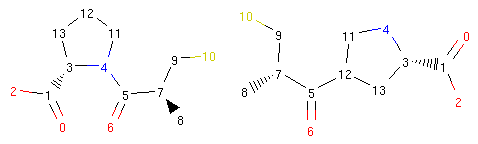

..  _morphing-basics:

Molecular Morphing Basics
=========================

This section showcases the most basic features and building blocks
needed to successfully start modifying compounds in an automated fashion
and, thus, initiate a chemical space journey. Not all of the features and settings of
the presented data structures will be discussed here so we encourage the interested reader to study
the `source-code-docs` where all library features are described in full.

The Python examples in this tutorial are taken from a sample Jupyter Notebook which
can be downloaded :download:`here <../../../notebooks/basics.ipynb>`. A rendered HTML version
with all calculation results can be viewed `here </_static/basics.html>`_.

If you run into an issue with the examples or have an idea or suggestion,
consider submitting to the `issue tracker <https://github.com/lich-uct/molpher-lib/issues>`_.

.. _morphing-algorithm:

Molecules and Morphing Operators
--------------------------------

At the core of :term:`molecular morphing <molecular morphing>` are so called
:term:`chemical operators` (or morphing operators). These are elemental structural modifications
by which one can move from a given molecular structure to another. Therefore, these operators
give us an opportunity to 'propel' our chemical spaceship in a certain direction [1]_.
Molpher-lib currently implements the same 8 chemical operators featured in Molpher (:numref:`fig-operators`).
Those should be sufficient to create any chemical structure even if we just specify
a single atom as input.

..  figure:: operators.png
    :scale: 75%
    :name: fig-operators

    Morphing operators implemented in Molpher-lib by default. They are used to
    generate new structures from existing ones. Adapted from [2]_.

However, it should be noted that there is no reason
why one should use exactly these 8 operators since they were chosen
more or less arbitrarily during Molpher development. Luckily, Molpher-lib enables
anyone to define their own operators in addition to these as we will show later.

Let's now use the Molpher-lib library to write a simple program which will use
a chemical operator to manipulate the structure of captopril, an
important stepping stone hypertension treatment.

.. py:currentmodule:: molpher.core

In order to proceed, we first need to initialize a :class:`~MolpherMol` instance:

..  code-block:: python
    :caption: Initializing a compound as a :class:`MolpherMol` instance.
    :name: list-mol-init
    :linenos:

    import molpher
    from molpher.core import MolpherMol

    mol = MolpherMol("O=C(O)[C@H]1N(C(=O)[C@H](C)CS)CCC1")

Therefore, we import the :mod:`molpher` package first. This is the main module of Molpher-lib.
Then we import the :class:`MolpherMol` class from `molpher.core`, which is the package
housing the main chemical space exploration capabilities and is the one we will be
working with most of the time. :class:`MolpherMol` instances have many attributes
and methods. One of the attributes we can access is the SMILES string associated
with the instance:

..  code-block:: python

    print(mol.smiles)

Output:

..  code-block:: none

    CC(CS)C(=O)N1CCCC1C(=O)O

As you can see, Molpher-lib discards stereochemistry from molecules. Since
we are still quite early in the development, this is only for the sake of simplicity.
Therefore, when working with compounds generated by the library
one needs to take into account all possible isomers because they are not
seen as distinct chemical species by the library, at least not just yet.
However, we are planning to expand in this area.

Since Molpher-lib is working with `RDKit <http://www.rdkit.org/>`_ behind the scenes, it is quite
straightforward to convert between Molpher-lib molecules and RDKit molecules.
All we need to do is just call the asRDMol method on our :class:`MolpherMol` instance:

..  code-block:: python

    rd_mol = mol.asRDMol()
    print(rd_mol)

Output:

..  code-block:: none

    <rdkit.Chem.rdchem.Mol object at 0x7f177c4bb940>

We can then use the RDKit representation to draw a 2D picture of our molecule.
In a Jupyter Notebook we would achieve that like so:

..  code-block:: python
    :linenos:

    from rdkit.Chem.Draw import IPythonConsole
    IPythonConsole.ipython_useSVG = False
    from rdkit.Chem.Draw.MolDrawing import MolDrawing

    mol.asRDMol() # embed the resulting molecule into the notebook as a PNG image

Output:

..  figure:: captopril.png

..  note:: You can see that stereochemistry is maintained in the picture.
    Molpher-lib remembers it from the input, but has no ability
    to work with it, yet. Therefore, all isomers are equal, but will remember
    the input configuration of all atoms even after modification as we will see next.

Let's now mobilize one of the chemical operators to generate new possible structures
that we could assemble from this set of atoms without changing any bond order.
This operator is called :class:`~.operators.RerouteBond.RerouteBond` and can be used as follows:

..  code-block:: python
    :linenos:

    from molpher.core.morphing.operators import RerouteBond

    rrbond = RerouteBond()
    rrbond.setOriginal(mol)
    morph = rrbond.morph()
    morph.asRDMol()

Output:

..  figure:: captopril_rerouted_1.png

We can see what happened more clearly if we view the structures
of the original captopril and its morph side by side
and with atom indices present:

..  code-block:: python
    :linenos:

    from rdkit.Chem.Draw.MolDrawing import DrawingOptions
    DrawingOptions.includeAtomNumbers=True

    rrbond.getOriginal().asRDMol()
    morph.asRDMol()

Output:

We can see that the operator disconnected the bond between atoms 4 and 5
and created a new bond between atoms 5 and 12. Therefore, the bond coming
from atom 5 to atom 4 was rerouted to point to atom 12.

There are obviously many reroutes for an average compound. The operator first observes
the possibilities when the :meth:`~.MorphingOperator.MorphingOperator.setOriginal`
method is called and then randomly selects one option
when the user requests a morph with the :meth:`~.MorphingOperator.MorphingOperator.morph`
method. Therefore, we could make a call to the morph method many times and each time
we would get a different possible reroute:

..  code-block:: python
    :linenos:

    rrbond.morph().asRDMol()
    rrbond.morph().asRDMol()
    rrbond.morph().asRDMol()
    rrbond.morph().asRDMol()

Output:

..  figure:: random_reroutes.png

From a synthetic viewpoint, many of the structures generated like this
might not be stable or synthetically viable. Therefore, generating
new possible drugs like this is quite a crude approach, but as we will show in the
next parts of our tutorial, Molpher-lib has features that can help
us prioritize more viable structures over others.

..  note:: The :meth:`~.MorphingOperator.MorphingOperator.setOriginal` and
    :meth:`~.MorphingOperator.MorphingOperator.morph` methods are part of an
    interface defined by the :class:`~.MorphingOperator.MorphingOperator` abstract class.
    By implementing the methods of this class, the user can create their own operators and easily
    plug them into the Molpher-lib ecosystem. We will show an example of this later.

.. [1] This means of 'chemical space travel' is not entirely new and a similar program (SPACESHIP) had been developed in the `past <http://dx.doi.org/10.1002/cmdc.200700021>`_.

.. [2] Hoksza D., Škoda P., Voršilák M., Svozil D. (2014) Molpher: a software framework for systematic chemical space exploration. J Cheminform. 6:7. `DOI <http://www.jcheminf.com/content/6/1/7>`_

Creating Morphs in Bulk
-----------------------

In the previous chapter, we outlined how :term:`chemical operators` work
using a very simple example and we did not really explore the full
range of possible structural modifications available to us.
In this section, we will make up for that and show how to
use Molpher-lib to easily generate thousands of compounds
from a single molecule.